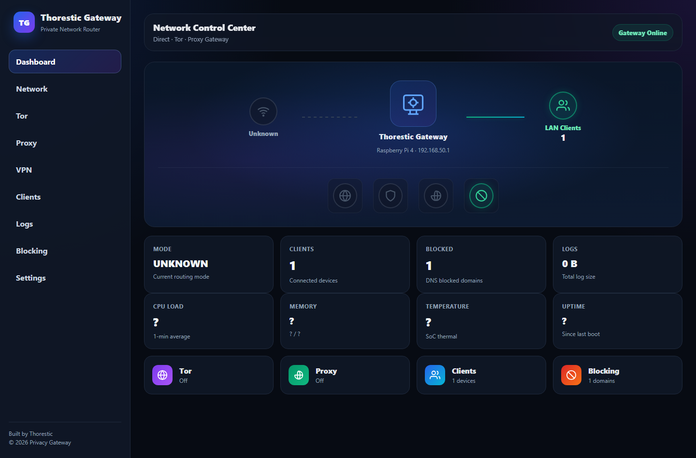
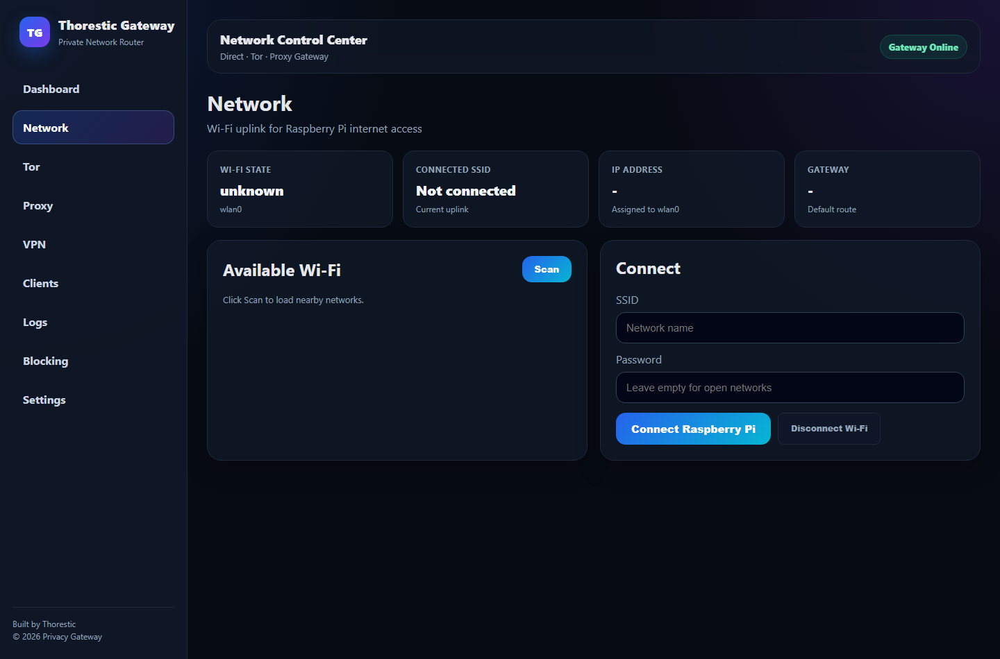

# Thorestic Privacy Gateway

My first Raspberry Pi networking project.

I built this because I wanted a Raspberry Pi 4 to work like a small privacy gateway that I can control from a web dashboard, not only from terminal commands.

[Read this README in Arabic](README.ar.md)

## What It Is

Thorestic Privacy Gateway is a Raspberry Pi project that combines:

- a FastAPI web dashboard
- Bash scripts for real Linux networking actions
- Wi-Fi uplink control from the browser
- Tor/proxy/direct mode pages
- client blocking and reconnect actions
- live DNS and connection logs using `tcpdump`
- Wi-Fi QR code settings
- public-safe documentation and examples

The Pi can be used between a router/client device and the internet. In my setup, `eth0` is the local gateway side, and `wlan0` can be used as the upstream internet connection.

## Screenshots

Dashboard:



Network page:



## Documentation

| English | Arabic | What it explains |
| --- | --- | --- |
| [WHAT_WE_BUILT.md](docs/WHAT_WE_BUILT.md) | [WHAT_WE_BUILT.ar.md](docs/WHAT_WE_BUILT.ar.md) | What was built and changed in the project. |
| [ARCHITECTURE.md](docs/ARCHITECTURE.md) | [ARCHITECTURE.ar.md](docs/ARCHITECTURE.ar.md) | How the website, FastAPI, scripts, services, and logs work together. |
| [SETUP.md](docs/SETUP.md) | [SETUP.ar.md](docs/SETUP.ar.md) | How to prepare the Raspberry Pi and run the project. |
| [COMMANDS.md](docs/COMMANDS.md) | [COMMANDS.ar.md](docs/COMMANDS.ar.md) | Useful commands used while building and debugging. |
| [TROUBLESHOOTING.md](docs/TROUBLESHOOTING.md) | [TROUBLESHOOTING.ar.md](docs/TROUBLESHOOTING.ar.md) | Problems I faced and how I fixed them. |
| [SECURITY.md](docs/SECURITY.md) | [SECURITY.ar.md](docs/SECURITY.ar.md) | What should not be pushed to a public repo. |

## Project Structure

```text
web/
  main.py                FastAPI routes, APIs, and backend logic
  ui.py                  shared layout and login rendering
  templates/base.html    base HTML page
  static/styles.css      website styling

scripts/
  *.sh                   Raspberry Pi network/service scripts
  net-logger.py          tcpdump log collector

configs/
  *.example              safe example config files only

systemd/
  *.service.example      example service files
```

At first, almost everything was inside `main.py`. I later split it a little so the UI files are separate from the Python backend, but without making the project too complicated.

## Quick Local Run

This only runs the web app. Real gateway actions need a Raspberry Pi with the right network setup and permissions.

```bash
python3 -m venv venv
./venv/bin/pip install -r requirements.txt
./venv/bin/uvicorn web.main:app --host 127.0.0.1 --port 8000
```

Then open:

```text
http://127.0.0.1:8000
```

## Privacy Note

This public repo does not include real passwords, Wi-Fi credentials, proxy credentials, logs, certificates, SSH keys, or private backups.

The files in `configs/` are examples only.

## AI Help

I used AI as a helper while building this project. It helped me understand Linux networking, write and fix scripts, connect FastAPI routes to shell scripts, debug errors.

I still tested the project on the Raspberry Pi and changed things based on what actually happened on the device.
